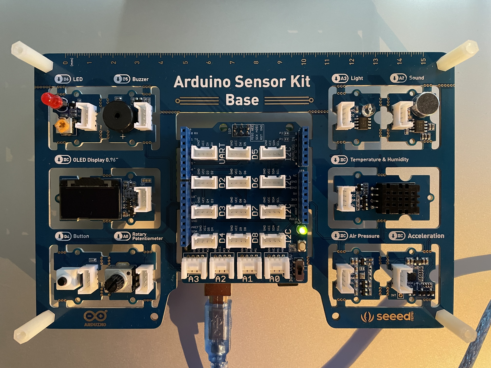
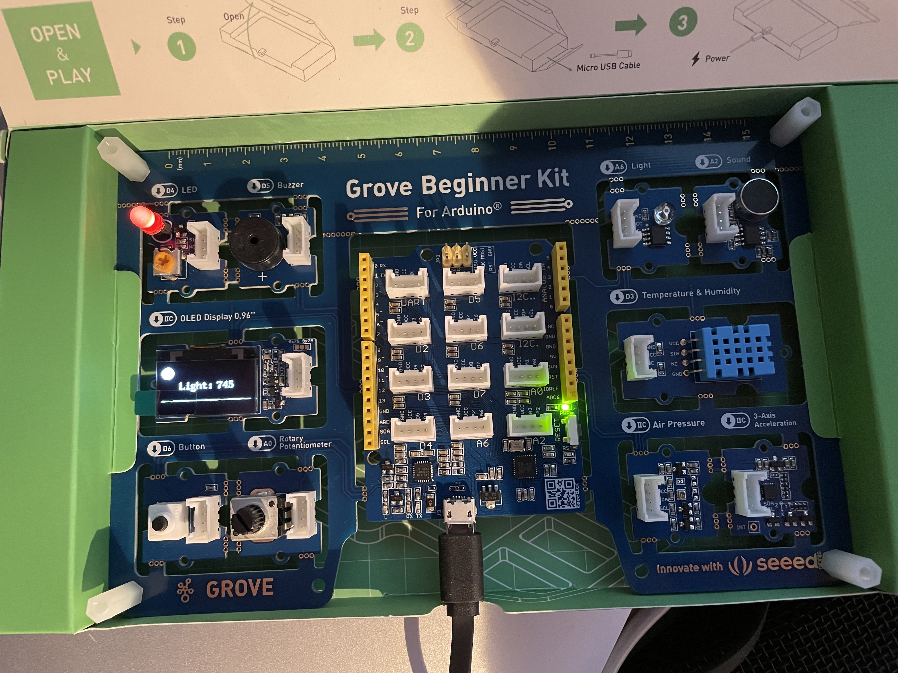
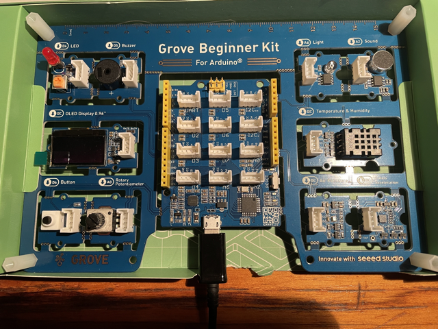
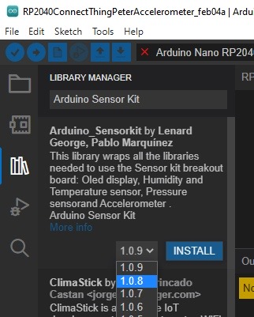
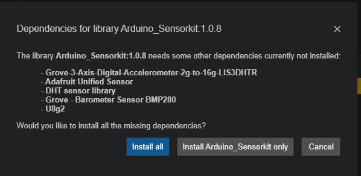
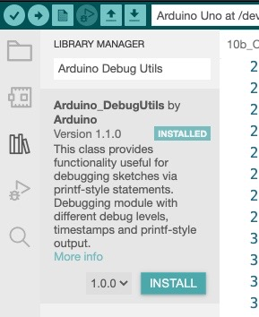
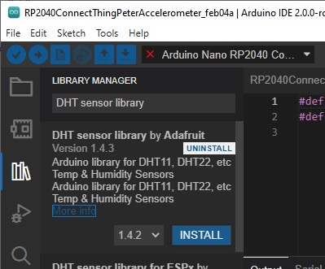
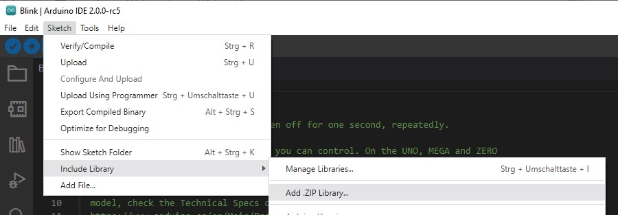
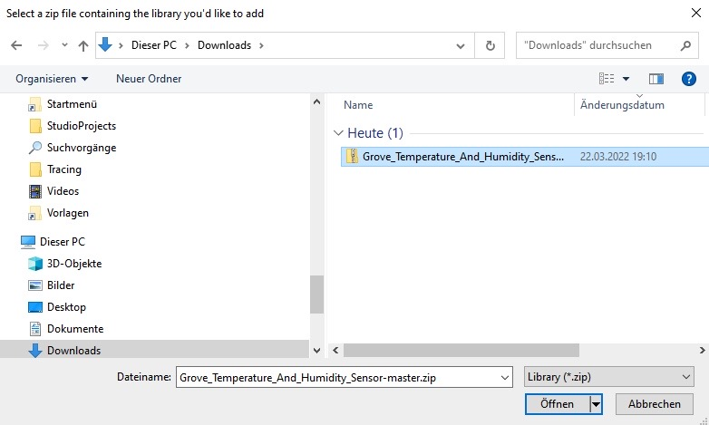

# VHS PC Driver installation

https://www.silabs.com/developers/usb-to-uart-bridge-vcp-drivers?tab=downloads

# Arduino sensor kit


Es scheint zwei Versionen des Arduino Sensor Kits zugeben - wie hier oben abgebildet mit blauem Temperatur-Sensor der den 
Digitalport D3 verwendet - oder mit schwarzem Temperatursensor der am I2C Bus hängt:


Ersetzt wurde der DHT11 durch den DHT20:

DHT20 - Grove - DHT20 Temperature & Humidity Sensor is the newly released version, an upgraded version of the DHT11.
https://www.seeedstudio.com/Grove-Temperature-Humidity-Sensor-V2-0-DHT20-p-4967.html

https://wiki.seeedstudio.com/Grove-Temperature-Humidity-Sensor-DH20/

Das Seeed Grove Beginner Kit for Arduino (seeed clone) hat teilweise eine andere Pin-Belegung und erfordert teilweise Anpassungen in den Sketches, die wir jeweils als Kommentar in den Sketches kennzeichnen, oder in einem separaten Sketch berücksichtigen:



auch dieses gibt es jetzt in einer neueren Vesion mit I2C DHT20:




https://sensorkit.arduino.cc/sensorkit/module/getting-started/lesson/00-getting-started

## Installieren der Sensor Kit Libraries in der Entwicklungsumgebung

https://www.arduino.cc/reference/en/libraries/arduino_sensorkit/

**!!!!!!!!! Wir müssen die Version 1.0.8 nehmen solange die Version 1.0.9 diesen Bug hat !!!!!!!**

https://github.com/arduino-libraries/Arduino_SensorKit/issues/21

Wir verwenden die neue Arduino IDE 2.x (Theia) von https://www.arduino.cc/en/software

In der IDE

- Links auf die Bücher klicken (Library manager)
- In das Suchfeld "Arduino Sensor Kit" eingeben
- Im Dropdown 1.0.8 auswählen
- "Install" klicken




Install all



## Installieren der Debugging Library in der Entwicklungsumgebung

Arduino Debug utils

https://github.com/arduino-libraries/Arduino_DebugUtils



- Links auf die Bücher klicken (Library manager)
- In das Suchfeld "Arduino Debug Utils" eingeben
- "Install" klicken

### Debug example

```
 #include "Arduino_DebugUtils.h" 
 #define LED 6 
   
 void setup() { 
   // put your setup code here, to run once: 
   pinMode(LED,OUTPUT);    //Sets the pinMode to Output  
   // enable debug messages on serial port 
   Serial.begin(9600); 

   // disable debug messages on serial port
   // Debug.setDebugLevel(DBG_NONE);
 } 
   
 void loop() { 
   // put your main code here, to run repeatedly: 
   Debug.print(DBG_INFO, "LED auf Digital-Port 6 anschalten"); 
   digitalWrite(LED, HIGH); //Sets the voltage to high  
 
 
   Debug.print(DBG_INFO, "1000 Millisekunden schlafen"); 
   delay(1000);             //Waits for 1000 milliseconds  
 
 
   Debug.print(DBG_INFO, "LED auf Digital-Port 6 ausschalten"); 
   digitalWrite(LED, LOW);  //Sets the voltage to low 
 
 
   Debug.print(DBG_INFO, "1000 Millisekunden schlafen"); 
   delay(1000);             //Waits for 1000 milliseconds  
 } 
 ```


## Lesson 1 LED  


Quelle **https://sensorkit.arduino.cc/sensorkit/module/lessons/lesson/01-the-led**

Unser erstes Programm:  Ansteuern einer LED (Leuchtdiode) über den Digitalausgang 6 des Arduiono Boards

[01_LED.ino](sketches/01_LED/01_LED.ino)

```
 // a constant, declared once and then used multiple times 
 const int ledPin = 6; 
   
 void setup() { 
   // put your setup code here, to run once: 
   pinMode(ledPin, OUTPUT);    //Sets the pinMode to Output  
 } 
   
 void loop() { 
   // put your main code here, to run repeatedly: 
   digitalWrite(ledPin, HIGH); //Sets the voltage to high  
   delay(1000);             //Waits for 1000 milliseconds  
   digitalWrite(ledPin, LOW);  //Sets the voltage to low 
   delay(1000);             //Waits for 1000 milliseconds  
 } 
``` 
 

### Struktur eines jeden Arduino Programms/Sketch:

```
void setup() {
  // Anweisungen die einmal zu Beginn laufen sollen - hier:
  // ...
}

void loop() {
  // Anweisungen die wiederholt immer wieder laufen sollen - hier:
  // ...

}
```

see https://github.com/arduino/ArduinoCore-avr/blob/master/cores/arduino/main.cpp

```
int main(void)
{
	init();

	initVariant();
	
	setup();
    
	for (;;) {
		loop();
		if (serialEventRun) serialEventRun();
	}
        
	return 0;
}
```

### Referenz

https://www.arduino.cc/reference/de/language/functions/digital-io/pinmode/

https://www.arduino.cc/reference/de/language/functions/digital-io/digitalwrite/

https://www.arduino.cc/reference/de/language/functions/time/delay/

### Lesson 1 mit Debugging

[01_LED_Debug.ino](sketches/01_LED_Debug/01_LED_Debug.ino)
 
Referenz
 
 
 https://github.com/arduino-libraries/Arduino_DebugUtils  
 
 
 
## Lesson 2a Button/Knopf - unser erster "Sensor" ein Knopf, der den Digital-Eingangs-Port auf an oder aus setzt

Quelle: https://sensorkit.arduino.cc/sensorkit/module/lessons/lesson/02-the-button

[02_Button.ino](sketches/02_Button/02_Button.ino)

 
 
Referenz:
 https://www.arduino.cc/reference/de/language/functions/digital-io/digitalread/  
 
 https://www.arduino.cc/reference/de/language/functions/communication/serial/begin/  
 
 https://www.arduino.cc/reference/de/language/functions/communication/serial/println/  
 
 
 
 
 
## Lesson 2b - Verknüpfung von LED und Knopf - wir steuern die LED mit dem Knopf

Quelle: Arduino Sensor Kit Examples - [Plug_Sketch_Play.ino](sketches/libraries/Arduino_Sensorkit/examples/Plug_Sketch_Play/Plug_Sketch_Play.ino)
 
[02b_LED_Button.ino](sketches/02b_LED_Button/02b_LED_Button.ino)


## Lesson 3 - Analoge Eingänge - das Potentionmeter auf Analogeingang A0

Quelle: https://sensorkit.arduino.cc/sensorkit/module/lessons/lesson/03-the-potentiometer

[03_Potentionmeter.ino](sketches/03_Potentiometer/03_Potentiometer.ino)

### analogRead()
Liest den Wert vom angegebenen analogen Pin ein. Die Arduino-Boards enthalten einen 10-Bit-Analog-zu-Digital-Konverter. D.h. das Board mappt Eingangsspannungen zwischen 0 und 5 V auf Integer-Werte zwischen 0 und 1023. Die erreichte Auflösung ist damit z.B. auf einem Arduino UNO 5 V / 1024 Teile oder 0,0049 V (4,9 mV) per Teil.

### Dreisatzrechnung mit map():
Bildet eine Zahl von einem Bereich in einen anderen ab.

### Für mathematisch Interessierte ist hier die ganze Funktion
```
long map(long x, long in_min, long in_max, long out_min, long out_max)
{
  return (x - in_min) * (out_max - out_min) / (in_max - in_min) + out_min;
}
````

Referenz:
https://www.arduino.cc/reference/de/language/functions/analog-io/analogread/

https://www.arduino.cc/reference/de/language/functions/math/map/

### Lesson 3b- LED-Blinkgeschwindigkeit mit Potentiometer steuern

Quelle: www.vilros.com/uskcode (Siehe Vilros Ultimate Starter Kit https://vilros.com/products/arduino-ultimate-starter-kit )

[03b_Potentiometer_LED_Debug.ino](sketches/03b_Potentiometer_LED_Debug/03b_Potentiometer_LED_Debug.ino)
 

## Lesson 4 Buzzer / Piezo - Tonausgabe mit Digital-Output Pin 5

Quelle: https://sensorkit.arduino.cc/sensorkit/module/lessons/lesson/04-the-buzzer

[04_Buzzer.ino](sketches/04_Buzzer/04_Buzzer.ino)
 
 
### tone()

Generiert einen Ton mit der angegebenen Frequenz (und 50% duty cycle) auf einem Pin. Eine Dauer des Tons kann festgelegt werden; Sonst wird der Ton abgespielt, bis ein noTone() aufgerufen wird. Der Pin kann an einen Piezo oder an einen Lautsprecher angeschlossen werden, um Töne abzuspielen.

Referenz: 
https://www.arduino.cc/reference/de/language/functions/advanced-io/tone/

### Lesson 4b Buzzer Tonhöhe mit Potentiometer steuern

Quelle: Copyright Peter Bendel

[04b_Buzzer_Potentiometer.ino](sketches/04b_Buzzer_Potentiometer/04b_Buzzer_Potentiometer.ino)

## Lesson 5  Lichtstärke messen mit dem Photoresistor  - Analoger Eingangsport Pin 3

Quelle: https://sensorkit.arduino.cc/sensorkit/module/lessons/lesson/05-the-light-sensor

[05_Photoresistor.ino](sketches/05_Photoresistor/05_Photoresistor.ino)
 
## Lesson 6 Umgebungslautstärke messen mit dem Geräusche-Sensor (Diaphragma) auf dem analogen Eingangsport 2

Quelle: https://sensorkit.arduino.cc/sensorkit/module/lessons/lesson/06-the-sound-sensor

[06_Sound_Sensor.ino](sketches/06_Sound_Sensor/06_Sound_Sensor.ino)

 
## Lesson 7 Wetterstation - Messen von Temperatur und Luftdruck/Höhe über Meer mit dem Grove Barometer Sensor

Verwendet den I2C Bus des Arduino.
Verwendet eine Bibliothek des Arduino Sensor Kit mit der Klasse "Pressure"

Quelle: https://sensorkit.arduino.cc/sensorkit/module/lessons/lesson/07-the-air-pressure-sensor

[07_Wetterstation.ino](sketches/07_Wetterstation/07_Wetterstation.ino)

### Pressure is a (global) instance of class SensorKit_BMP280

[Arduino_SensorKit.h](sketches/libraries/Arduino_Sensorkit/src/Arduino_SensorKit.h) : 

 SensorKit_BMP280 Pressure; 
 extern SensorKit_BMP280 Pressure; 
 
 
### The interface of class SensorKit_BMP280 is defined here - it comes with the Arduino Sensorkit library that we installed in the beginning:

[Arduino_SensorKit_BMP280.h](sketches/libraries/Arduino_Sensorkit/src/Arduino_SensorKit_BMP280.h) 

```
 class SensorKit_BMP280 { 
 
 
     BMP280 BMP; 
 
 
     public: 
         SensorKit_BMP280(); 
         bool begin(); 
         void end(); 
 
 
         float readTemperature(); 
         uint32_t readPressure(); 
         float readAltitude(); 
 }; 
 ```
 
### class bMP280 is defined in 

[Seeed_BMP280.h](sketches/libraries/Grove_-_Barometer_Sensor_BMP280/Seeed_BMP280.h) 

Referenz:
https://wiki.seeedstudio.com/Grove-Barometer_Sensor-BMP280/

https://www.seeedstudio.com/blog/2019/12/30/what-is-barometric-pressure-sensor-and-arduino-guide-to-get-started/

I2C Bus 

http://hlembke.de/arduinoablage/crate.php?20150411i2c

https://unsinnsbasis.de/i2c-schnittstelle-esp32-arduino/

https://www.arduino.cc/en/Reference/Wire

## Lesson 8 - Temperatur und Luftfeuchtigkeitssensor DHT11 am Digitaleingang D3 oder DHT20 am I2C Bus

Quelle: https://sensorkit.arduino.cc/sensorkit/module/lessons/lesson/08-the-temperature-sensor

### Code für DHT11:

[08_Temperatur_Luftfeuchtigkeit_DH11Sensor.ino](sketches/08_Temperatur_Luftfeuchtigkeit_DH11Sensor/08_Temperatur_Luftfeuchtigkeit_DH11Sensor.ino)


Der DTH11 Sensor hat 2 Komponenten, einen für Temperatur und einen für Luftfeuchtigkeit (analoge Werte).
Ausserdem hat er einen kleinen Chip, der die analogen Werte in digitale Werte konvertiert und mit Hilfe der Arduino Sensor Kit library ausgelesen werden kann

**Environment.begin()** initialisiert den Sensor und die Methoden **Environment.readTemperature()** & **Environment.readHumidity()** geben die Werte für Temperatur und Luftfeuchtigkeit zurück.

Referenz:
https://www.arduino.cc/reference/en/libraries/dht-sensor-library/
https://github.com/adafruit/DHT-sensor-library
https://www.adafruit.com/product/386

### Code für den neuen DHT 20:

Zunächst müssen wir die DHT library des SensorKit ersetzen durch diejenige des DHT20:

- DHT library (1.4.3) deinstallieren (installiert mit Sensorkit)
- Library Manager
- Ins Suchfeld "DHT sensor library" eingeben
- Mit der Maus über "Installed" navigieren
- UINSTALL drücken



Dann installieren wir die "richtige" Library für den DHT20 Sensor:

- Diese Datei herunterladen:
- [Download DHT20 ZIP library](https://files.seeedstudio.com/wiki/Grove-Temperature-Humidity-Sensor/Grove_Temperature_And_Humidity_Sensor-master.zip)
- Dann: Sketch -> Include LIbrary -> Add .ZIP library

- Im File Explorer die heruntergeladene ZIP Datei auswählen


Quelle (allerdings modifiziert Copyright Peter Bendel): https://wiki.seeedstudio.com/Grove-Temperature-Humidity-Sensor-DH20/

[08_Temperatur_Luftfeuchtigkeit_DHT20_Sensor.ino](sketches/08_Temperatur_Luftfeuchtigkeit_DHT20_Sensor/08_Temperatur_Luftfeuchtigkeit_DHT20_Sensor.ino)

 
 Referenz:  

 DHT20 https://wiki.seeedstudio.com/Grove-Temperature-Humidity-Sensor-DH20/ 

 seeed Grove DHT Library:   

 [Download](https://files.seeedstudio.com/wiki/Grove-Temperature-Humidity-Sensor/Grove_Temperature_And_Humidity_Sensor-master.zip)
 
 
## Lesson 9: 3-Achsen Beschleunigungssensor am I2C Bus.

Mit diesem Sensor können wir erkennen, wenn und in welche Richtung sich der Sensor bewegt/beschleunigt - und zwar in den 3 Achsen x, y und z:

Die ausgegebenen Werte sind in g (Erdbeschleunigung) ausgegeben, also in Ruhe ist die z-Achse ca. 1.0g weil das die Erdanziehungskraft auf der Erde ist.
Wenn der Sensor seine Lage ändert, z.B. indem man ihn aufrecht stellt, wirkt die Erdanziehung auf eine andere Achse.
Damit kan man auch Drehungen und die Lage erkennen.
Eine konstante Bewegung in dieselbe Richtung kann man nur während des Beschleunigens oder Abbremsens erkennen, aber nicht während der Fahrt,
da hierbei keine Beschleunigungskraft wirkt (ausser der weiter vorhandenen Erdanziehung, die aber konstant bleibt).


Quelle: https://sensorkit.arduino.cc/sensorkit/module/lessons/lesson/09-the-accelerometer-sensor

Es wird die globale Instanz **Accelerometer** der Klasse SensorKit_LIS3DHTR verwendet.

[09_Beschleunigung.ino](/Users/peterbendel/git/ArduinoPlayground/Arduino_Sensorkit/sketches/09_Beschleunigung/09_Beschleunigung.ino)


Referenz: 
https://wiki.seeedstudio.com/Grove-3-Axis_Digital_Accelerometer-1.5g/

## Lesson 10: der OLED Bildschirm

Bisher haben wir Informationen auf dem seriellen Port an den Computer geschickt und dort am Bildschirm ausgegeben.
Für Projekte ist das aber unpraktisch, da wollen wir einen kleinen Bildschirm direkt in unserem Projekt haben.
Hierfür kann der OLED Bildschirm verwendet werden.

Der Bildschirm hat 128*64 Pixels. Der Koordinatenursprung ist links oben (0,0) und wird in Zeichen (nicht in Pixel) angegeben.

Das folgende Programm liest den Analog-Eingang A0 (Potentiometer) und zeigt den
Wert auf dem Display an:

Quelle (modifiziert, Copyright Peter Bendel):

https://sensorkit.arduino.cc/sensorkit/module/lessons/lesson/10-the-oled-screen

[10_OLED_Bildschirm.ino](sketches/10_OLED_Bildschirm/10_OLED_Bildschirm.ino)

 
### Lesson 10b: Wetterstation auf OLED ausgeben

Quelle: Copyright Peter Bendel

Mehrere I2C devices

**!!!!!!!!! Wir müssen die Arduiono Sensor Kit Library Version 1.0.8 nehmen solange die Version 1.0.9 diesen Bug hat !!!!!!!**

https://github.com/arduino-libraries/Arduino_SensorKit/issues/21

[10b_OLED_Wetterstation.ino](sketches/10b_OLED_Wetterstation/10b_OLED_Wetterstation.ino)

