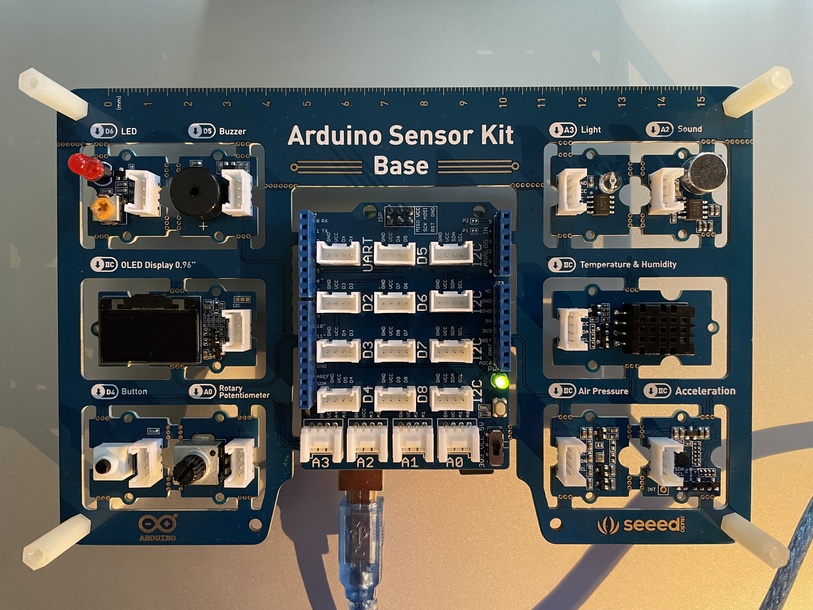
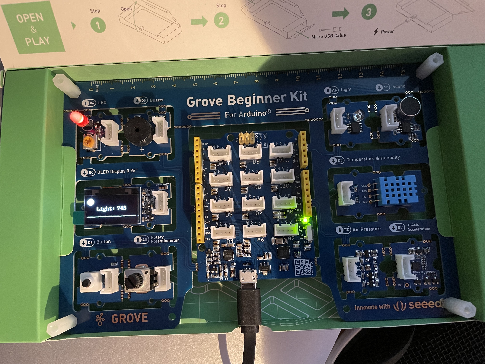

# Arduino sensor kit


Es scheint zwei Versionen des Arduino Sensor Kits zugeben - wie hier oben abgebildet mit blauem Temperatur-Sensor der den 
Digitalport D3 verwendet - oder mit schwarzem Temperatursensor der am I2C Bus hängt:


Ersetzt wurde der DHT11 durch den DHT20:

DHT20 - Grove - DHT20 Temperature & Humidity Sensor is the newly released version, an upgraded version of the DHT11.
https://www.seeedstudio.com/Grove-Temperature-Humidity-Sensor-V2-0-DHT20-p-4967.html

https://wiki.seeedstudio.com/Grove-Temperature-Humidity-Sensor-DH20/

Das Grove Beginner Kit (seeed clone) hat teilweise eine andere Pin-Belegung und erfordert teilweise Anpassungen in den Sketches, die wir jeweils als Kommentar in den Sketches kennzeichnen, oder in einem separaten Sketch berücksichtigen:




https://sensorkit.arduino.cc/sensorkit/module/getting-started/lesson/00-getting-started

## Installieren der Sensor Kit Libraries in der Entwicklungsumgebung

https://www.arduino.cc/reference/en/libraries/arduino_sensorkit/

**!!!!!!!!! Wir müssen die Version 1.0.8 nehmen solange die Version 1.0.9 diesen Bug hat !!!!!!!**

https://github.com/arduino-libraries/Arduino_SensorKit/issues/21


## Installieren der Debugging Library in der Entwicklungsumgebung

Arduino Debug utils

https://github.com/arduino-libraries/Arduino_DebugUtils


### Debug example

```
 #include "Arduino_DebugUtils.h" 
 #define LED 6 
   
 void setup() { 
   // put your setup code here, to run once: 
   pinMode(LED,OUTPUT);    //Sets the pinMode to Output  
   // enable debug messages on serial port 
   Serial.begin(9600); 
 } 
   
 void loop() { 
   // put your main code here, to run repeatedly: 
   Debug.print(DBG_INFO, "LED auf Digital-Port 6 anschalten"); 
   digitalWrite(LED, HIGH); //Sets the voltage to high  
 
 
   Debug.print(DBG_INFO, "1000 Millisekunden schlafen"); 
   delay(1000);             //Waits for 1000 milliseconds  
 
 
   Debug.print(DBG_INFO, "LED auf Digital-Port 6 ausschalten"); 
   digitalWrite(LED, LOW);  //Sets the voltage to low 
 
 
   Debug.print(DBG_INFO, "1000 Millisekunden schlafen"); 
   delay(1000);             //Waits for 1000 milliseconds  
 } 
 ```


## Lesson 1 LED  


Quelle **https://sensorkit.arduino.cc/sensorkit/module/lessons/lesson/01-the-led**

Unser erstes Programm:  Ansteuern einer LED (Leuchtdiode) über den Digitalausgang 6 des Arduiono Boards

[01_LED.ino](sketches/01_LED/01_LED.ino)

```
 // a constant, declared once and then used multiple times 
 const int ledPin = 6; 
   
 void setup() { 
   // put your setup code here, to run once: 
   pinMode(ledPin, OUTPUT);    //Sets the pinMode to Output  
 } 
   
 void loop() { 
   // put your main code here, to run repeatedly: 
   digitalWrite(ledPin, HIGH); //Sets the voltage to high  
   delay(1000);             //Waits for 1000 milliseconds  
   digitalWrite(ledPin, LOW);  //Sets the voltage to low 
   delay(1000);             //Waits for 1000 milliseconds  
 } 
``` 
 

### Struktur eines jeden Arduino Programms/Sketch:

```
void setup() {
  // Anweisungen die einmal zu Beginn laufen sollen - hier:
  // ...
}

void loop() {
  // Anweisungen die wiederholt immer wieder laufen sollen - hier:
  // ...

}
```

see https://github.com/arduino/ArduinoCore-avr/blob/master/cores/arduino/main.cpp

```
int main(void)
{
	init();

	initVariant();
	
	setup();
    
	for (;;) {
		loop();
		if (serialEventRun) serialEventRun();
	}
        
	return 0;
}
```

### Referenz

https://www.arduino.cc/reference/de/language/functions/digital-io/pinmode/

https://www.arduino.cc/reference/de/language/functions/digital-io/digitalwrite/

https://www.arduino.cc/reference/de/language/functions/time/delay/

### Lesson 1 mit Debugging

[01_LED_Debug.ino](sketches/01_LED_Debug/01_LED_Debug.ino)

```
 // reference the debugging utilties which are provided in another text (header) file 
 #include "Arduino_DebugUtils.h" 
 
 
 // a constant, declared once and then used multiple times 
 const int ledPin = 6; 
   
 void setup() { 
   // put your setup code here, to run once: 
   pinMode(ledPin,OUTPUT);    //Sets the pinMode to Output  
   // enable debug messages on serial port 
   Serial.begin(9600); 
   // disable debug messages on serial port 
   //Debug.setDebugLevel(DBG_NONE); 
 } 
   
 void loop() { 
   // put your main code here, to run repeatedly: 
   Debug.print(DBG_INFO, "LED auf Digital-Port 6 anschalten"); 
   digitalWrite(ledPin, HIGH); //Sets the voltage to high  
 
 
   Debug.print(DBG_INFO, "1000 Millisekunden schlafen"); 
   delay(1000);             //Waits for 1000 milliseconds  
 
 
   Debug.print(DBG_INFO, "LED auf Digital-Port 6 ausschalten"); 
   digitalWrite(ledPin, LOW);  //Sets the voltage to low 
 
 
   Debug.print(DBG_INFO, "1000 Millisekunden schlafen"); 
   delay(1000);             //Waits for 1000 milliseconds  
 } 
 ```
 
Referenz
 
 
 https://github.com/arduino-libraries/Arduino_DebugUtils  
 
 
 
 
 
## Lesson 2a Button/Knopf - unser erster "Sensor" ein Knopf, der den Digital-Eingangs-Port auf an oder aus setzt

Quelle: https://sensorkit.arduino.cc/sensorkit/module/lessons/lesson/02-the-button

[02_Button.ino](sketches/02_Button/02_Button.ino)


```
 // a constant, declared once and then used multiple times 
 const int button = 4; // connect button to digital port D4 
   
 int button_state = 0;         // variable for reading the pushbutton status 
   
 void setup() { 
     Serial.begin(9600); 
      
     // initialize the pushbutton pin as an input: 
     pinMode(button, INPUT); 
 } 
   
 void loop(){ 
     // read the state of the pushbutton value: 
     button_state = digitalRead(button); 
   
     if (button_state == HIGH) { 
         // turn LED on: 
         Serial.println("Knopf gedrückt!"); 
     } else { 
         Serial.println("Knopf nicht gedrückt!"); 
     } 
     delay(50); 
 } 
 ```
 
 
Referenz:
 https://www.arduino.cc/reference/de/language/functions/digital-io/digitalread/  
 
 https://www.arduino.cc/reference/de/language/functions/communication/serial/begin/  
 
 https://www.arduino.cc/reference/de/language/functions/communication/serial/println/  
 
 
 
 
 
## Lesson 2b - Verknüpfung von LED und Knopf - wir steuern die LED mit dem Knopf

Quelle: Arduino Sensor Kit Examples - [Plug_Sketch_Play.ino](sketches/libraries/Arduino_Sensorkit/examples/Plug_Sketch_Play/Plug_Sketch_Play.ino)
 
[02b_LED_Button.ino](sketches/02b_LED_Button/02b_LED_Button.ino)

 ```
 int button = 4; 
 int LED = 6; 
 
 
 void setup() { 
   // put your setup code here, to run once: 
   Serial.begin(9600); 
 
 
   pinMode(button , INPUT); 
   pinMode(LED, OUTPUT); 
 
 
   digitalWrite(LED, LOW); 
 } 
 
 
 void loop() { 
   // put your main code here, to run repeatedly: 
   if (digitalRead(button)) { 
     Serial.println("Knopf gedrückt - schalte LED ein"); 
     digitalWrite(LED, HIGH); 
   } else { 
     Serial.println("Knopf nicht gedrückt - schalte LED aus"); 
     digitalWrite(LED, LOW); 
   } 
 } 
 ```

## Lesson 3 - Analoge Eingänge - das Potentionmeter auf Analogeingang A0

Quelle: https://sensorkit.arduino.cc/sensorkit/module/lessons/lesson/03-the-potentiometer

[03_Potentionmeter.ino](sketches/03_Potentiometer/03_Potentiometer.ino)

```
 int potentiometer = A0; //Assign to pin A0 
   
 void setup() 
 { 
     Serial.begin(9600); //Begin serial communication 
     pinMode(potentiometer, INPUT); //Sets the pinmode to input 
 } 
   
 void loop() 
 {    
     int sensor_value = analogRead(potentiometer); //Read the value from the potentiometer connected to the A0 pin 
     int value = map(sensor_value, 0, 1023, 0, 100); //Map the value from 0, 1023 to 0, 100 
     Serial.print("Potentiometer value: "); 
     Serial.println(value); //Print the value in the serial monitor 
     delay(500); //Add a delay to see the value every 1/2 second 
 } 
 ```

### analogRead()
Liest den Wert vom angegebenen analogen Pin ein. Die Arduino-Boards enthalten einen 10-Bit-Analog-zu-Digital-Konverter. D.h. das Board mappt Eingangsspannungen zwischen 0 und 5 V auf Integer-Werte zwischen 0 und 1023. Die erreichte Auflösung ist damit z.B. auf einem Arduino UNO 5 V / 1024 Teile oder 0,0049 V (4,9 mV) per Teil.

### Dreisatzrechnung mit map():
Bildet eine Zahl von einem Bereich in einen anderen ab.

### Für mathematisch Interessierte ist hier die ganze Funktion
```
long map(long x, long in_min, long in_max, long out_min, long out_max)
{
  return (x - in_min) * (out_max - out_min) / (in_max - in_min) + out_min;
}
````

Referenz:
https://www.arduino.cc/reference/de/language/functions/analog-io/analogread/

https://www.arduino.cc/reference/de/language/functions/math/map/

### Lesson 3b- LED-Blinkgeschwindigkeit mit Potentiometer steuern

Quelle: www.vilros.com/uskcode (Siehe Vilros Ultimate Starter Kit https://vilros.com/products/arduino-ultimate-starter-kit )

[03b_Potentiometer_LED_Debug.ino](sketches/03b_Potentiometer_LED_Debug/03b_Potentiometer_LED_Debug.ino)

```
 // reference the debugging utilties which are provided in another text (header) file 
 #include "Arduino_DebugUtils.h" 
 
 const int ledPin = 6; 
 int potentiometer = A0;  
   
 void setup() { 
   // put your setup code here, to run once: 
   pinMode(ledPin,OUTPUT);    //Sets the pinMode to Output  
   pinMode(potentiometer, INPUT); //Sets the pinmode to input 
   // enable debug messages on serial port 
   Serial.begin(9600); 
    
   // disable debug messages on serial port 
   //Debug.setDebugLevel(DBG_NONE); 
 } 
   
 void loop() { 
   // put your main code here, to run repeatedly: 
   int sensorValue = analogRead(potentiometer); //Read the value from the potentiometer connected to the A0 pin 
   Debug.print(DBG_INFO, "Potentiometer Wert: %i", sensorValue); 
    
   Debug.print(DBG_INFO, "LED auf Digital-Port 6 anschalten"); 
   digitalWrite(ledPin, HIGH); //Sets the voltage to high  
 
 
   Debug.print(DBG_INFO, "%i Millisekunden schlafen", sensorValue); 
   delay(sensorValue);             //Waits for 1000 milliseconds  
 
 
   Debug.print(DBG_INFO, "LED auf Digital-Port 6 ausschalten"); 
   digitalWrite(ledPin, LOW);  //Sets the voltage to low 
 
 
   Debug.print(DBG_INFO, "%i Millisekunden schlafen", sensorValue); 
   delay(sensorValue);             //Waits for 1000 milliseconds  
 } 
 ```
 

## Lesson 4 Buzzer / Piezo - Tonausgabe mit Digital-Output Pin 5

Quelle: https://sensorkit.arduino.cc/sensorkit/module/lessons/lesson/04-the-buzzer

[04_Buzzer.ino](sketches/04_Buzzer/04_Buzzer.ino)
 
 ```
 #define BUZZER 5 
   
 void setup() 
 {   
   // put your setup code here, to run once: 
   pinMode(BUZZER, OUTPUT); 
 } 
   
 void loop() 
 { 
   tone(BUZZER, 85); //Set the voltage to high and makes a noise 
   delay(1000);//Waits for 1000 milliseconds 
   noTone(BUZZER);//Sets the voltage to low and makes no noise 
   delay(1000);//Waits for 1000 milliseconds 
 } 
 ```
 
 
### tone()

Generiert einen Ton mit der angegebenen Frequenz (und 50% duty cycle) auf einem Pin. Eine Dauer des Tons kann festgelegt werden; Sonst wird der Ton abgespielt, bis ein noTone() aufgerufen wird. Der Pin kann an einen Piezo oder an einen Lautsprecher angeschlossen werden, um Töne abzuspielen.

Referenz: 
https://www.arduino.cc/reference/de/language/functions/advanced-io/tone/

### Lesson 4b Buzzer Tonhöhe mit Potentiometer steuern

Quelle: Copyright Peter Bendel

[04b_Buzzer_Potentiometer.ino](sketches/04b_Buzzer_Potentiometer/04b_Buzzer_Potentiometer.ino)

```
 #include "Arduino_DebugUtils.h" 
 
 
 const int BUZZER=5; 
 int potentiometer = A0;  
   
 void setup() 
 {   
   // put your setup code here, to run once: 
   pinMode(BUZZER, OUTPUT); 
   pinMode(potentiometer, INPUT); //Sets the pinmode to input 
   // enable debug messages on serial port 
   Serial.begin(9600); 
    
 } 
   
 void loop() 
 { 
   int sensorValue = analogRead(potentiometer); //Read the value from the potentiometer connected to the A0 pin 
   Debug.print(DBG_INFO, "Potentiometer Wert: %i", sensorValue); 
   int frequenz = map(sensorValue, 0, 1023, 31, 200); //Map the value from 0, 1023 to 31, 200 
   Debug.print(DBG_INFO, "Frequenz: %i", frequenz); 
    
   tone(BUZZER, frequenz); //Set the voltage to high and makes a noise 
   delay(100);//Waits for 1000 milliseconds 
 } 
 ```
 

## Lesson 5  Lichtstärke messen mit dem Photoresistor  - Analoger Eingangsport Pin 3

Quelle: https://sensorkit.arduino.cc/sensorkit/module/lessons/lesson/05-the-light-sensor

[05_Photoresistor.ino](sketches/05_Photoresistor/05_Photoresistor.ino)

```
 int light_sensor = A3;  
   
 void setup() { 
 Serial.begin(9600); //begin Serial Communication 
 } 
   
 void loop() { 
   int raw_light = analogRead(light_sensor); // read the raw value from light_sensor pin (A3) 
   int light = map(raw_light, 0, 1023, 0, 100); // map the value from 0, 1023 to 0, 100 
   
   Serial.print("Light level: ");  
   Serial.println(light); // print the light value in Serial Monitor 
   
   delay(300); // add a delay to only read and print every 0.3 second 
 } 
 ```
 
## Lesson 6 Umgebungslautstärke messen mit dem Geräusche-Sensor (Diaphragma) auf dem analogen Eingangsport 2

Quelle: https://sensorkit.arduino.cc/sensorkit/module/lessons/lesson/06-the-sound-sensor

[06_Sound_Sensor.ino](sketches/06_Sound_Sensor/06_Sound_Sensor.ino)

```
 int sound_sensor = A2; //assign to pin A2 
 
 
 void setup() 
 { 
   Serial.begin(9600); //begin Serial Communication 
 } 
 
 
 void loop() 
 { 
   int soundValue = 0; //create variable to store the sum of 32 different readings 
   // why 32 ? each value is between 0 and 1023 and our integer has 
   // a max value of 32768 
   for (int i = 0; i < 32; i++) //create a for loop to read 
   { 
     soundValue += analogRead(sound_sensor);   //read the sound sensor 
   } 
   Serial.print(soundValue); //print the value of sound sensor 
   // Compute average of 32 values 
   soundValue = soundValue / 32; 
   Serial.print(" - Average: "); 
   Serial.println(soundValue); //print the value of sound sensor 
    
 
 
 
 
   //if a value higher than 500 is registered, we will print the following 
   //this is done so that we can clearly see if the threshold is met 
   if (soundValue > 500) { 
     Serial.println("         ||        "); 
     Serial.println("       ||||||      "); 
     Serial.println("     |||||||||     "); 
     Serial.println("   |||||||||||||   "); 
     Serial.println(" ||||||||||||||||| "); 
     Serial.println("   |||||||||||||   "); 
     Serial.println("     |||||||||     "); 
     Serial.println("       ||||||      "); 
     Serial.println("         ||        "); 
   } 
   delay(50); //a shorter delay between readings 
 } 
 ```
 
## Lesson 7 Wetterstation - Messen von Temperatur und Luftdruck/Höhe über Meer mit dem Grove Barometer Sensor

Verwendet den I2C Bus des Arduino.
Verwendet eine Bibliothek des Arduino Sensor Kit mit der Klasse "Pressure"

Quelle: https://sensorkit.arduino.cc/sensorkit/module/lessons/lesson/07-the-air-pressure-sensor

[07_Wetterstation.ino](sketches/07_Wetterstation/07_Wetterstation.ino)

```
 #include "Arduino_SensorKit.h" 
   
 float pressure; 
   
 void setup() { 
   Serial.begin(9600); 
   Pressure.begin(); 
 } 
   
 void loop() { 
   // Get and print temperatures 
   Serial.print("Temp: "); 
   Serial.print(Pressure.readTemperature()); 
   Serial.println("C"); // The unit for  Celsius because        original arduino don't support speical symbols 
   
   // Get and print atmospheric pressure data 
   Serial.print("Pressure: "); 
   Serial.print(Pressure.readPressure()); 
   Serial.println("Pa"); 
   
   // Get and print altitude data 
   Serial.print("Altitude: "); 
   Serial.print(Pressure.readAltitude()); 
   Serial.println("m"); 
   
   Serial.println("\n");//add a line between output of different times. 
   
   delay(1000); 
 } 
 ```

### Pressure is a (global) instance of class SensorKit_BMP280

[Arduino_SensorKit.h](sketches/libraries/Arduino_Sensorkit/src/Arduino_SensorKit.h) : 

 SensorKit_BMP280 Pressure; 
 extern SensorKit_BMP280 Pressure; 
 
 
### The interface of class SensorKit_BMP280 is defined here - it comes with the Arduino Sensorkit library that we installed in the beginning:

[Arduino_SensorKit_BMP280.h](sketches/libraries/Arduino_Sensorkit/src/Arduino_SensorKit_BMP280.h) 

```
 class SensorKit_BMP280 { 
 
 
     BMP280 BMP; 
 
 
     public: 
         SensorKit_BMP280(); 
         bool begin(); 
         void end(); 
 
 
         float readTemperature(); 
         uint32_t readPressure(); 
         float readAltitude(); 
 }; 
 ```
 
### class bMP280 is defined in 

[Seeed_BMP280.h](sketches/libraries/Grove_-_Barometer_Sensor_BMP280/Seeed_BMP280.h) 

Referenz:
https://wiki.seeedstudio.com/Grove-Barometer_Sensor-BMP280/

https://www.seeedstudio.com/blog/2019/12/30/what-is-barometric-pressure-sensor-and-arduino-guide-to-get-started/

I2C Bus 

http://hlembke.de/arduinoablage/crate.php?20150411i2c

https://unsinnsbasis.de/i2c-schnittstelle-esp32-arduino/

https://www.arduino.cc/en/Reference/Wire

## Lesson 8 - Temperatur und Luftfeuchtigkeitssensor DHT11 am Digitaleingang D3 oder DHT20 am I2C Bus

Quelle: https://sensorkit.arduino.cc/sensorkit/module/lessons/lesson/08-the-temperature-sensor

### Code für DHT11:

[08_Temperatur_Luftfeuchtigkeit_DH11Sensor.ino](sketches/08_Temperatur_Luftfeuchtigkeit_DH11Sensor/08_Temperatur_Luftfeuchtigkeit_DH11Sensor.ino)

```
 #define DHTPIN 3 // By default the module connected to pin D3, it can be changed, define it before the #include of the library 
 #include "Arduino_SensorKit.h" 
   
 void setup() { 
   Serial.begin(9600); 
   Environment.begin(); 
 } 
   
 void loop() { 
    
   Serial.print("Temperature = "); 
   Serial.print(Environment.readTemperature()); //print temperature 
   Serial.println(" C"); 
   Serial.print("Humidity = "); 
   Serial.print(Environment.readHumidity()); //print humidity 
   Serial.println(" %"); 
   delay(2000); 
    
 } 

```

Der DTH11 Sensor hat 2 Komponenten, einen für Temperatur und einen für Luftfeuchtigkeit (analoge Werte).
Ausserdem hat er einen kleinen Chip, der die analogen Werte in digitale Werte konvertiert und mit Hilfe der Arduino Sensor Kit library ausgelesen werden kann

**Environment.begin()** initialisiert den Sensor und die Methoden **Environment.readTemperature()** & **Environment.readHumidity()** geben die Werte für Temperatur und Luftfeuchtigkeit zurück.

Referenz:
https://www.arduino.cc/reference/en/libraries/dht-sensor-library/
https://github.com/adafruit/DHT-sensor-library
https://www.adafruit.com/product/386

### Code für den neuen DHT 20:

Quelle (allerdings modifiziert Copyright Peter Bendel): https://wiki.seeedstudio.com/Grove-Temperature-Humidity-Sensor-DH20/

[08_Temperatur_Luftfeuchtigkeit_DHT20_Sensor.ino](sketches/08_Temperatur_Luftfeuchtigkeit_DHT20_Sensor/08_Temperatur_Luftfeuchtigkeit_DHT20_Sensor.ino)

```

 // Example testing sketch for various DHT humidity/temperature sensors 
 #include "Wire.h" 
 #include "DHT.h" 
 #define DHTTYPE DHT20   // DHT 20 
 /*Notice: The DHT10 and DHT20 is different from other DHT* sensor ,it uses i2c interface rather than one wire*/ 
 /*So it doesn't require a pin.*/ 
 DHT dht(DHTTYPE);         //   DHT10 DHT20 don't need to define Pin 
   
 void setup() { 
   
     Serial.begin(9600); 
     Serial.println("DHT20 test!"); 
     Wire.begin(); 
     dht.begin(); 
 } 
   
 void loop() { 
     float temp_hum_val[2] = {0}; 
     // Reading temperature or humidity takes about 250 milliseconds! 
     // Sensor readings may also be up to 2 seconds 'old' (its a very slow sensor) 
   
   
     if (!dht.readTempAndHumidity(temp_hum_val)) { 
         Serial.print("Luftfeuchtigkeit: "); 
         Serial.print(temp_hum_val[0]); 
         Serial.print(" %\t"); 
         Serial.print("Temperatur: "); 
         Serial.print(temp_hum_val[1]); 
         Serial.println(" Grad Celsius"); 
     } else { 
         Serial.println("Konnte Temperatur und Luftfeuchtigkeit nicht lesen."); 
     } 
   
     delay(1500); 
 } 
 ```
 
 
 Referenz:  

 DHT20 https://wiki.seeedstudio.com/Grove-Temperature-Humidity-Sensor-DH20/ 

 seeed Grove DHT Library:   

 [Download](https://files.seeedstudio.com/wiki/Grove-Temperature-Humidity-Sensor/Grove_Temperature_And_Humidity_Sensor-master.zip)
 
 
## Lesson 9: 3-Achsen Beschleunigungssensor am I2C Bus.

Mit diesem Sensor können wir erkennen, wenn und in welche Richtung sich der Sensor bewegt/beschleunigt - und zwar in den 3 Achsen x, y und z:

Die ausgegebenen Werte sind in g (Erdbeschleunigung) ausgegeben, also in Ruhe ist die z-Achse ca. 1.0g weil das die Erdanziehungskraft auf der Erde ist.
Wenn der Sensor seine Lage ändert, z.B. indem man ihn aufrecht stellt, wirkt die Erdanziehung auf eine andere Achse.
Damit kan man auch Drehungen und die Lage erkennen.
Eine konstante Bewegung in dieselbe Richtung kann man nur während des Beschleunigens oder Abbremsens erkennen, aber nicht während der Fahrt,
da hierbei keine Beschleunigungskraft wirkt (ausser der weiter vorhandenen Erdanziehung, die aber konstant bleibt).


Quelle: https://sensorkit.arduino.cc/sensorkit/module/lessons/lesson/09-the-accelerometer-sensor

Es wird die globale Instanz **Accelerometer** der Klasse SensorKit_LIS3DHTR verwendet.

[09_Beschleunigung.ino](/Users/peterbendel/git/ArduinoPlayground/Arduino_Sensorkit/sketches/09_Beschleunigung/09_Beschleunigung.ino)

```
#include "Arduino_SensorKit.h"
 
void setup() {
  // put your setup code here, to run once:
  Serial.begin(9600);
  
  Accelerometer.begin();
}
 
void loop() {
  // put your main code here, to run repeatedly:
  // 3 axis
  Serial.print("x:"); 
  Serial.print(Accelerometer.readX());  // Read the X Value 
  Serial.print("  ");
  Serial.print("y:"); 
  Serial.print(Accelerometer.readY());  // Read the Y Value       
  Serial.print("  ");
  Serial.print("z:"); 
  Serial.println(Accelerometer.readZ());// Read the Z Value
 
  delay(200);
}
```

Referenz: 
https://wiki.seeedstudio.com/Grove-3-Axis_Digital_Accelerometer-1.5g/

## Lesson 10: der OLED Bildschirm

Bisher haben wir Informationen auf dem seriellen Port an den Computer geschickt und dort am Bildschirm ausgegeben.
Für Projekte ist das aber unpraktisch, da wollen wir einen kleinen Bildschirm direkt in unserem Projekt haben.
Hierfür kann der OLED Bildschirm verwendet werden.

Der Bildschirm hat 128*64 Pixels. Der Koordinatenursprung ist links oben (0,0) und wird in Zeichen (nicht in Pixel) angegeben.

Das folgende Programm liest den Analog-Eingang A0 (Potentiometer) und zeigt den
Wert auf dem Display an:

Quelle (modifiziert, Copyright Peter Bendel):

https://sensorkit.arduino.cc/sensorkit/module/lessons/lesson/10-the-oled-screen

[10_OLED_Bildschirm.ino](sketches/10_OLED_Bildschirm/10_OLED_Bildschirm.ino)

```
 #include "Arduino_SensorKit.h" 
   
 void setup() { 
   Oled.begin(); 
   Oled.setFlipMode(true); // Sets the rotation of the screen 
 } 
   
 void loop() { 
   int random_value = analogRead(A0);   //read value from A0 
   
   Oled.setFont(u8x8_font_chroma48medium8_r);  
   Oled.setCursor(0, 33);    // Set the Coordinates  
   Oled.print("A0 Pin:");    
   Oled.print(random_value); // Print the Values   
   Oled.print("   "); // Clear older values 
   Oled.refreshDisplay();    // Update the Display  
   delay(1000); 
 } 
 ```
 
### Lesson 10b: Wetterstation auf OLED ausgeben

Quelle: Copyright Peter Bendel

Mehrere I2C devices

**!!!!!!!!! Wir müssen die Arduiono Sensor Kit Library Version 1.0.8 nehmen solange die Version 1.0.9 diesen Bug hat !!!!!!!**

https://github.com/arduino-libraries/Arduino_SensorKit/issues/21

[10b_OLED_Wetterstation.ino](sketches/10b_OLED_Wetterstation/10b_OLED_Wetterstation.ino)

```
 #include "Arduino_SensorKit.h" 
   
 float pressure; 
   
 void setup() { 
   Oled.begin(); 
   Oled.setFlipMode(true); 
   Pressure.begin(); 
 } 
   
 void loop() { 
 
 
   Oled.setFont(u8x8_font_amstrad_cpc_extended_r);  
    
   // Get and print temperatures 
   Oled.setCursor(0, 1); 
   Oled.print("Temperatur: "); 
   Oled.setCursor(3, 2); 
   Oled.print(Pressure.readTemperature()); 
   Oled.print(" C   "); // The unit for  Celsius because        original arduino don't support speical symbols 
   
   // Get and print atmospheric pressure data 
   Oled.setCursor(0, 3); 
   Oled.print("Luftdruck: "); 
   Oled.setCursor(3, 4); 
   Oled.print(Pressure.readPressure()); 
   Oled.print(" Pa   "); 
   
   // Get and print altitude data 
   Oled.setCursor(0, 5); 
   Oled.print("Hoehe:");  
   Oled.setCursor(3, 6); 
   Oled.print(Pressure.readAltitude()); 
   Oled.print(" m  "); 
   
   Oled.refreshDisplay();    // Update the Display   
   
   delay(1000); 
 } 
```