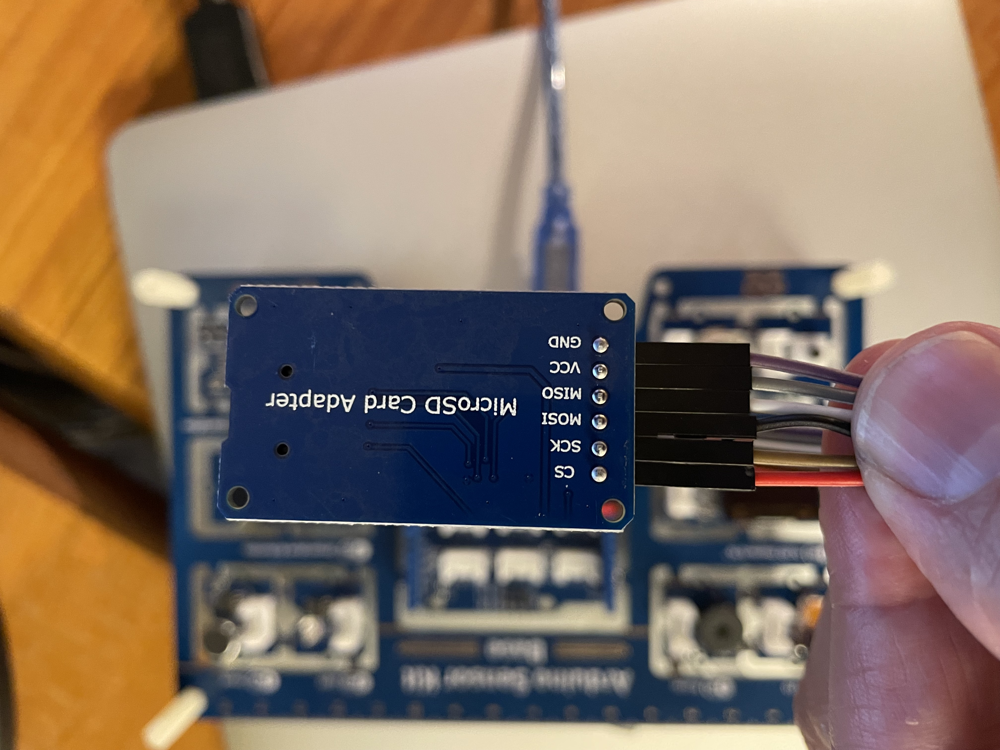

## Beispiel für einen SD-Kartenleser

Zum Beispiel AZDelivery SPI Micro SD Card Shield kompatibel mit Arduino 

### Belegung der SPI Anschlüsse

Serial Peripheral Interface (SPI) ist ein synchrones serielles Datenprotokoll, das von Mikrocontrollern zur schnellen Kommunikation mit einem oder mehreren Peripheriegeräten über kurze Entfernungen verwendet wird.

https://docs.arduino.cc/learn/communication/spi
https://www.arduino.cc/reference/en/language/functions/communication/spi/


```
CS = Chip select 3,3 oder 5 V
MOSI = Master out Slave in 3,3 oder 5 V
MISO = Master in Slave out 3,3 oder 5 V
SCK = System clock 3,3 oder 5 V
GND = Massse / Minus-Pol 5 V
VCC = Plus-Pol 5V
```


### Anschluss am Arduino

Wichtig: der SD-Card-Reader benötigt an VCC + 5 Volt. 
Beim Seeed Sensor Kit gibt es einen + 3,3 und einen +5V Anschluss und der +5V ist der Richtige.
Die Steuerung kann wahlweise über 3,3 oder 5 V erfolgen





